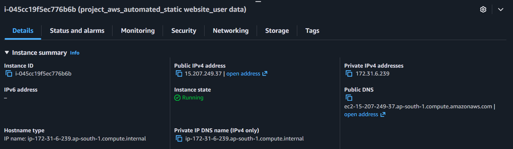
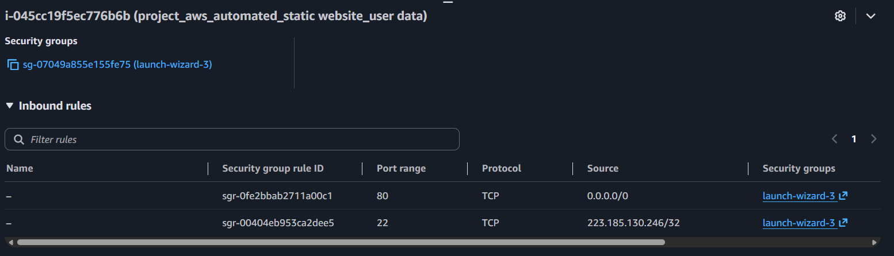
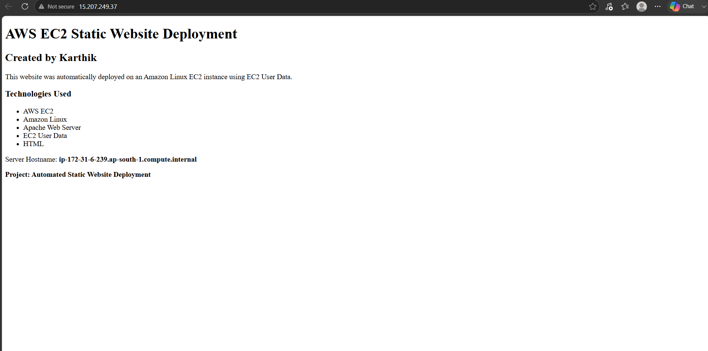

## Automated Static Website Deployment on AWS EC2 using the user data

### Project Overview

This project demonstrates how to automatically deploy a static website on an Amazon Linux EC2 instance using EC2 User Data.

When the EC2 instance is launched, the User Data script automatically:

\- Updates the system packages

\- Installs the Apache web server

\- Starts the Apache service

\- Enables Apache to start automatically

\- Creates and deploys a static HTML website

### Architecture 

User

&#x20; |

&#x20; | HTTP (Port 80)

&#x20; ↓

Amazon EC2 Instance

&#x20; |

&#x20; ↓

Apache Web Server

&#x20; |

&#x20; ↓

Static HTML Website

### Technologies Used

\- AWS EC2

\- Amazon Linux

\- Apache HTTP Server

\- EC2 User Data

\- HTML

\- Linux Shell Script

### Deployment Process

1\. Launch an Amazon Linux EC2 instance.

2\. Configure a Security Group.

3\. Allow HTTP traffic on port 80.

4\. Restrict SSH access to the administrator's IP address.

5\. Add the User Data script during EC2 launch.

6\. Launch the EC2 instance.

7\. User Data automatically installs and configures Apache.

8\. The static website is deployed automatically.

9\. Access the website using the EC2 public IPv4 address.

## Project Files

### userdata.sh

Contains the EC2 User Data script responsible for automatically configuring the web server and deploying the website.

### README.md

Project documentation explaining the architecture, deployment process, technologies, and implementation.

### Security

\- HTTP port 80 is open to allow users to access the website.

\- SSH port 22 is restricted to the administrator's IP address.

### Project Objective

The objective of this project is to understand basic AWS EC2 deployment, Linux web server configuration, Security Groups, and automation using EC2 User Data.

### Screenshots

### EC2 Instance

### Security Group Configuration 

### Server

### Author

Karthikeya Puligadda
